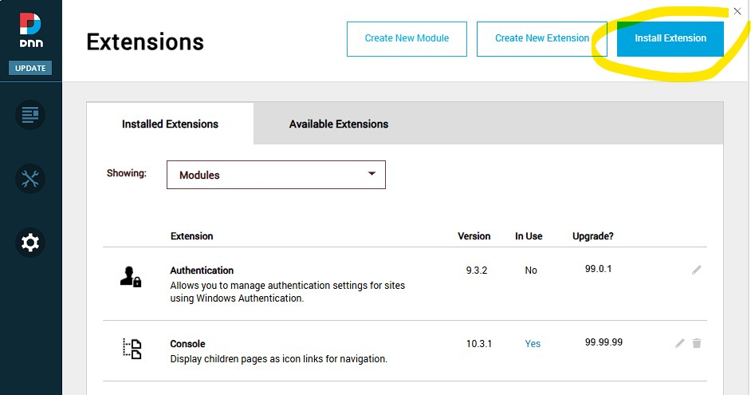
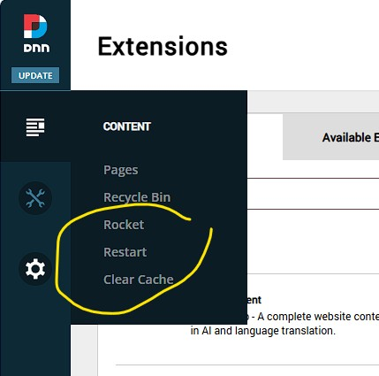
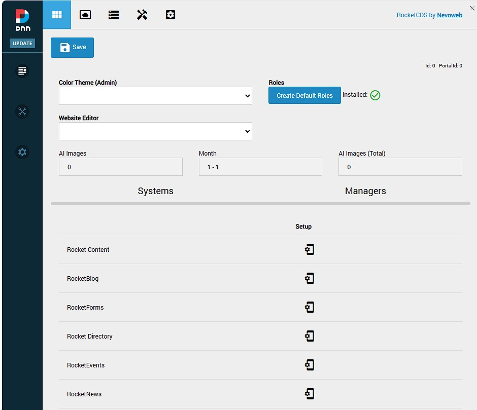
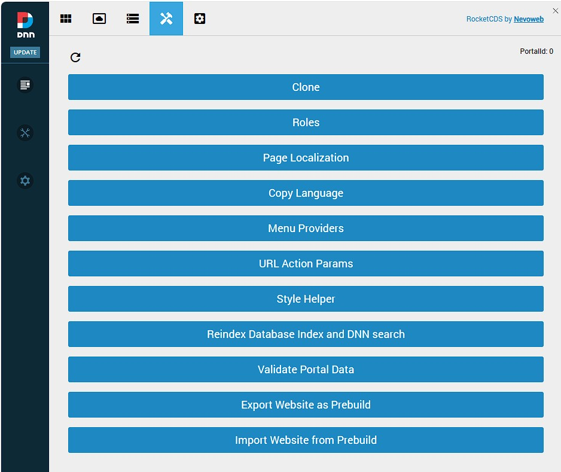
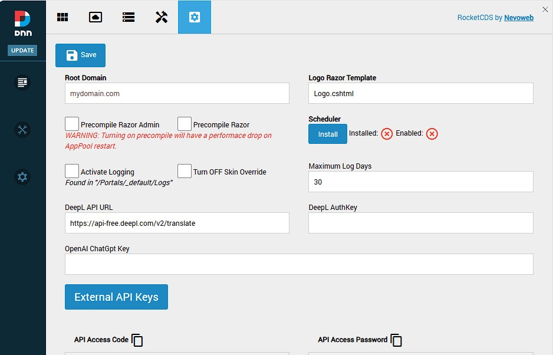

# Installation and First Look

This guide will walk you through the installation of the RocketCDS suite and provide a brief tour of the new "Rocket" menu options that become available in the DNN Persona Bar.

We'll begin with an existing installation of the DNN CMS.

---

## Step 1: Download RocketCDS

First, you need to download the installation package from the official GitHub repository.

*   **Go to the RocketCDS releases page:** [https://github.com/Rocket-CDS/RocketCDS/releases](https://github.com/Rocket-CDS/RocketCDS/releases)
*   Download the latest release.

### Full vs. Upgrade Packages

You will notice two different installation packages available:

1.  **RocketCDS.zip (Full Installation):** This package contains all the necessary files for a new installation, including all modules, libraries, and core assemblies.
2.  **RocketCDS_upgrade.zip (Upgrade Installation):** This package is smaller because it omits certain core assemblies related to image processing (e.g., `ImageProcessor.dll`).

The reason for two packages is that the image processing assemblies are often locked by the DNN application pool when images are being served and cached. Attempting to upgrade these locked files can cause installation failures. The upgrade package allows for a smooth update of all other components without interrupting the site.

> **Important:** If you need to update the image processing assemblies, you must use the full package. Before doing so, it is crucial to use the **PB > Restart** menu option. This action, created by the Rocket suite itself, helps to release file locks and ensure a successful upgrade.

---

## Step 2: Install the Package

The installation process follows the standard procedure for any DNN module.

1.  Log in as a SuperUser (host) account.
2.  Navigate to the Persona Bar (PB) and go to **Settings > Extensions**.
3.  Click on the **Install Extension** button.

    

4.  Follow the on-screen wizard to upload and install the `RocketCDS.zip` or `RocketCDS_upgrade.zip` package you downloaded.

---

## Step 3: A Quick Tour of the Rocket Menu

Once the installation is complete, you will find a new "Rocket" icon in the Persona Bar. Clicking on this reveals a powerful set of tools for managing your DNNrocket environment.

### Key Management Options

Two of the most frequently used options are located at the top:

*   **Restart AppPool:** This provides a convenient way to restart the application's process without needing access to the server or IIS. This is useful when you need to ensure all changes are loaded fresh.
*   **Clear Cache:** This clears all of DNN's cache, including data and image caches. It is essential for development to see changes immediately and is critical for releasing file locks before an upgrade, as mentioned in Step 1.

### Other Major Options

Below the main management options, you will find several other sections:

*   **Web Services:** Manage and monitor the custom web services provided by the DNNrocket framework.
    

*   **AppThemes:** This is the heart of the theming engine. Here you can manage the AppThemes that control the look, feel, and functionality of your modules.  
    

*   **AppTheme Sources:** View and manage the source files for your AppThemes, including templates from GitHub.
    

*   **RocketTools:** A suite of developer tools for debugging, testing, and managing your application's data.
    

*   **Global Settings:** Configure system-wide settings that affect all Rocket modules.
    

This concludes the initial installation and tour. You are now ready to start building powerful applications with RocketCDS.
