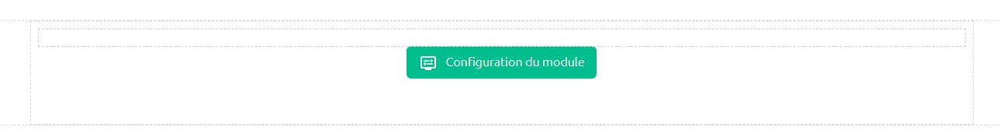
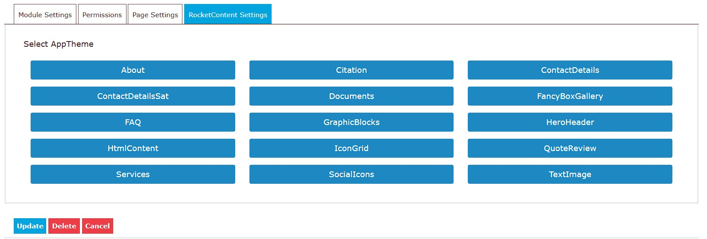
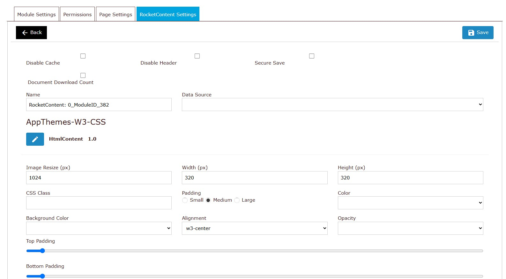
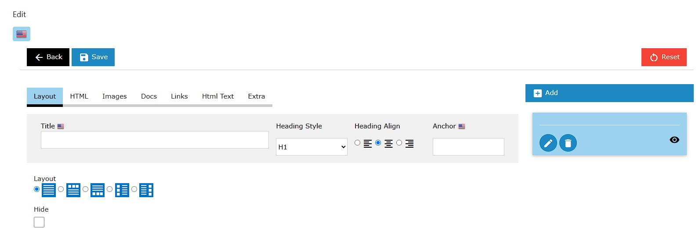
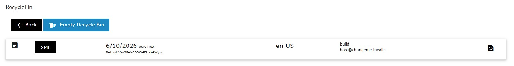

# Using the RocketContent Module

This tutorial provides a walkthrough of how to set up and use the RocketContent module after it has been added to a DNN page. RocketContent is a versatile module that can be configured to display almost any kind of structured content.

---

## Step 1: Initial Configuration

After adding the RocketContent module to a page for the first time, you will be prompted to configure it. The module cannot display anything until it knows which **AppTheme** to use for rendering its content and administrative interfaces.

Click the **Configure** button to begin the setup process.

---

## Step 2: Select an AppTheme

You will be presented with a screen to select the AppTheme that will define the module's behavior and appearance.

For this tutorial, we will use the default "W3 AppTheme" project and select the **"HtmlContent"** AppTheme. This is a flexible theme designed for general-purpose HTML content.

1.  Select the **Project** (e.g., "config-w3").
2.  Select the **AppTheme** (e.g., "HtmlContent").
3.  Click **Save**.

Once saved, the module will use this AppTheme for all its operations, from data entry fields to the final public display.

---

## Step 3: Module Settings

After selecting an AppTheme, you will be taken to the module's settings page. This page is divided into two main parts: standard settings common to all RocketContent modules and custom settings specific to the chosen AppTheme.

### Standard Settings

Based on the `ModuleSettings.cshtml` file, here are the standard options available:

*   **Disable Cache:** Check this to disable all caching for the module's output. This is useful during development when you need to see changes immediately, but it should generally be left unchecked in a production environment for better performance.
*   **Disable Header:** This prevents the module from adding its required CSS and JavaScript files to the page's `<head>` tag. This is an advanced option for scenarios where you are managing all page dependencies manually.
*   **Secure Save:** If checked, only users with Administrator permissions can save changes in the "Edit Data" screen. This is useful for preventing content editors from modifying critical or sensitive content.
*   **Count Downloads:** If the content includes links to downloadable files, checking this box will enable a counter to track how many times each file has been downloaded.
*   **Name:** A friendly, internal name for this specific module instance. It can be helpful for identification when using the "Data Source" feature.
*   **Data Source:** This powerful feature allows you to make this module's content available to other modules. You can select another RocketContent module on your site to act as the data source, effectively reusing content across multiple pages or modules.

### AppTheme Settings

Below the standard settings, you will find a section for settings that are unique to the "HtmlContent" AppTheme. Each AppTheme can define its own set of options to control its behavior.

Once you have configured the settings, click the **Save** button (or the back button) to return to the public view.

---

## Step 4: Editing Data

To add or modify the content for the module, enter the "Edit" mode from the module's action menu. The fields you see here are entirely defined by the selected AppTheme.

The "HtmlContent" AppTheme provides a flexible set of fields for creating rich content layouts.

Simply add your content into the administrative fields and click **Save**. The module will then render this data on the public view according to the logic in the AppTheme's `View.cshtml` template.

Feel free to experiment with the different fields and AppThemes to see what is possible.

---

## Step 5: The Recycle Bin

Mistakes happen, and the Recycle Bin is your safety net. Every time you save a change to the module's data, the previous version is automatically saved as a historical record.

You can access the Recycle Bin from the module's action menu.

From here, you can view previous versions of your content and choose to restore any of them, overwriting the current data. The system typically keeps a history of the last **10 versions** of the data.

---

### A Word of Caution: Changing AppThemes

You can change a module's AppTheme at any time by returning to the **Settings** page and clicking the "Edit" icon next to the AppTheme name.

However, be careful. If you switch to a new AppTheme that has a completely different data structure and then save new data, your original content may become inaccessible. While the Recycle Bin can help, it's best to be sure before switching themes on a live module with important content.
