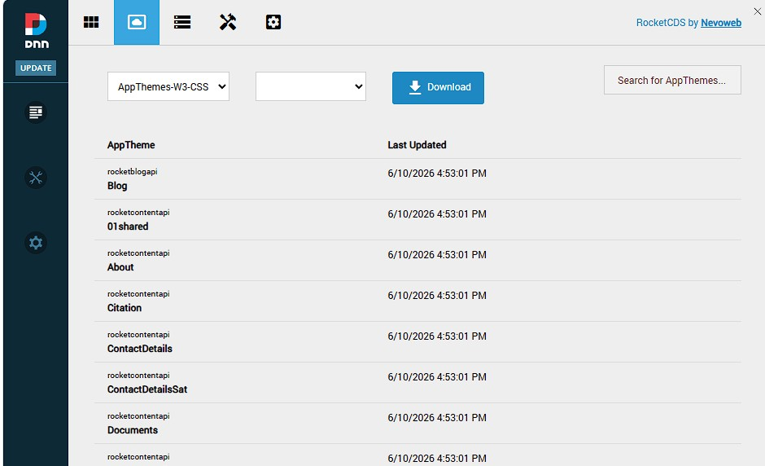
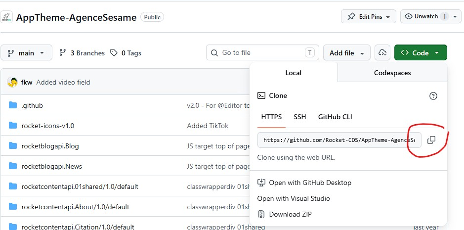
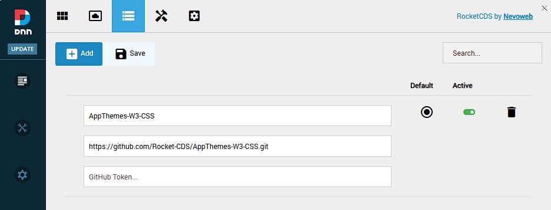
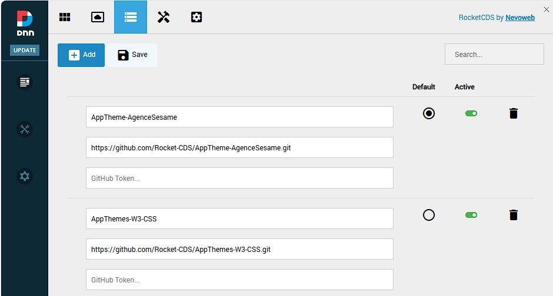
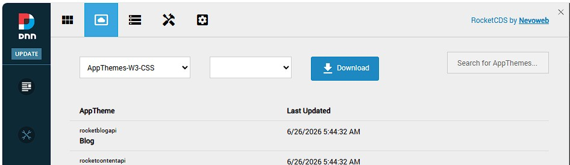

# Install AppThemes

AppThemes are distributed as GitHub projects. The default project is **AppThemes-W3-CSS**, hosted at [https://github.com/Rocket-CDS/AppThemes-W3-CSS](https://github.com/Rocket-CDS/AppThemes-W3-CSS). When downloaded, the entire contents of the repository are extracted into the system-level AppTheme folder (`/DesktopModules/DNNrocket/AppThemes/`), making every theme in the project immediately available to all portals.

---

## Section 1: Downloading AppThemes-W3-CSS

### Automatic Download

The **AppThemes-W3-CSS** project is downloaded automatically the first time a Rocket module is added to a page. No manual steps are required. The system fetches the latest version directly from GitHub and installs it into the system-level AppTheme folder.

### Manual Download from the Rocket Menu

If the automatic download did not complete (for example, due to a network issue at install time), the AppThemes project can be downloaded manually at any time from the Rocket Persona Bar.

1.  Open the **Rocket** menu in the DNN Persona Bar.
2.  Click **AppThemes**.

    

3.  The AppThemes list shows the currently installed themes. Click the **Download** button to pull the latest version of the default AppThemes-W3-CSS project from GitHub.

The system connects to the configured GitHub repository, downloads a ZIP archive of the repository, extracts it, and copies each AppTheme folder into the system-level AppTheme directory. Existing files are overwritten, so this process also serves as the standard upgrade path when a new version of the AppTheme project is released on GitHub.

---

## Section 2: Adding Additional AppTheme Projects

Any public GitHub repository that follows the AppTheme folder structure can be registered as an additional source. For example, **AppTheme-AgenceSesame** ([https://github.com/Rocket-CDS/AppTheme-AgenceSesame](https://github.com/Rocket-CDS/AppTheme-AgenceSesame)) is a free AppTheme project built for use with the **WisePro** prebuilds.

### Step 1 — Get the Repository URL from GitHub

Navigate to the repository on GitHub. The URL you need is simply the address of the repository's main page, exactly as it appears in your browser's address bar.



Copy the full URL, for example:

```
https://github.com/Rocket-CDS/AppTheme-AgenceSesame
```

### Step 2 — Register the Source in AppTheme Sources

1.  Open the **Rocket** menu in the DNN Persona Bar and click **AppTheme Sources**.

    

2.  Click **Add** to create a new source entry.
3.  Fill in the form:
    *   **Name** — a short label for this project, used in the download dropdown (e.g., `AgenceSesame`).
    *   **GitHub Repo URL** — the repository URL copied in Step 1.
4.  Save the entry.

    

### Step 3 — Download the AppThemes

Once the source is registered, navigate to **AppThemes** in the Rocket menu. The project name you entered now appears in the project **dropdown**. Select it, then click **Download** to fetch all AppThemes from that repository.



The system downloads the repository archive from GitHub, extracts it, and installs every AppTheme folder it contains into the system-level AppTheme directory — identical to the process used for the default AppThemes-W3-CSS project. Re-downloading at any time will update the installed themes to the latest version from GitHub.

---

## Section 3: Private Repositories

Private GitHub repositories are fully supported. Because GitHub requires authentication to download a private repository archive, you must provide a **Personal Access Token (PAT)** when registering the source.

When adding a private repository in **AppTheme Sources**, enter the token in the **GitHub Token** field alongside the repository URL:

*   The token must belong to a GitHub account that has **read access** to the private repository.
*   The token must have the **`repo`** scope (or at minimum the `contents: read` fine-grained permission) so that the system can download the repository's ZIP archive.

> **Important:** Without the correct permissions on the token, the download will silently fail. If an AppTheme project does not appear after downloading a private repo, check the system log and verify that the token scope includes read access to repository contents.

The token is stored alongside the project entry in AppTheme Sources and is used automatically every time that project is downloaded or updated.

---
