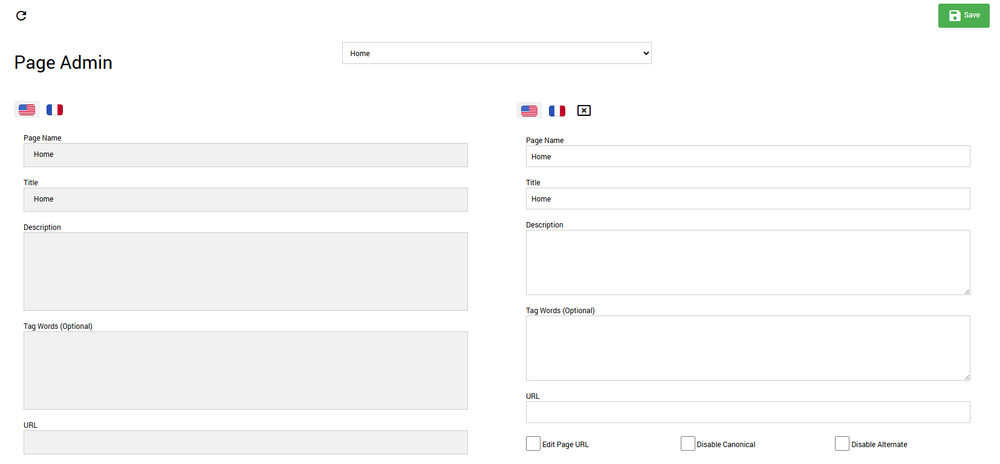

# Page Localization

The RocketCDS suite provides a fast and efficient way to handle multilingual SEO by localizing page names and URLs. This feature is found in the Persona Bar under **Rocket > Tools > Page Localization**.

It is designed as a lightweight alternative to DNN's built-in content localization feature.

---

## Why Use Rocket Page Localization?

*   **Speed and Simplicity:** DNN's content localization creates a separate copy of a page for each language, which can be slow and complex to manage. The RocketCDS approach simply provides a way to assign a different title and URL to the *same page* for each language, which is much faster.
*   **SEO Focused:** This tool focuses on the most critical elements for multilingual SEO: the page `title` tag and the page URL.
*   **No Need for DNN Content Localization:** All Rocket modules are inherently multilingual. They can display content in multiple languages without needing separate versions of pages. For this reason, it is **highly recommended that you do NOT turn on DNN's content localization feature** when building a site with RocketCDS.

---

## How to Use the Page Localization Tool

Using the tool is straightforward:

1.  Navigate to the Persona Bar and go to **Rocket > Tools**.
2.  Click on **Page Localization**.
3.  You will see a list of the pages on your portal. Use the dropdown to select the page you wish to localize.
4.  The tool will display a set of fields for each language that is active on your portal.
5.  For each language, you can enter a custom **Page Name** (which becomes the `<title>` tag) and a custom **URL**.
6.  Click **Save** to apply your changes.

The system will now automatically use the specified page name and URL when a user is viewing the site in that language, providing a better user experience and improved SEO without the overhead of DNN's full localization system.
